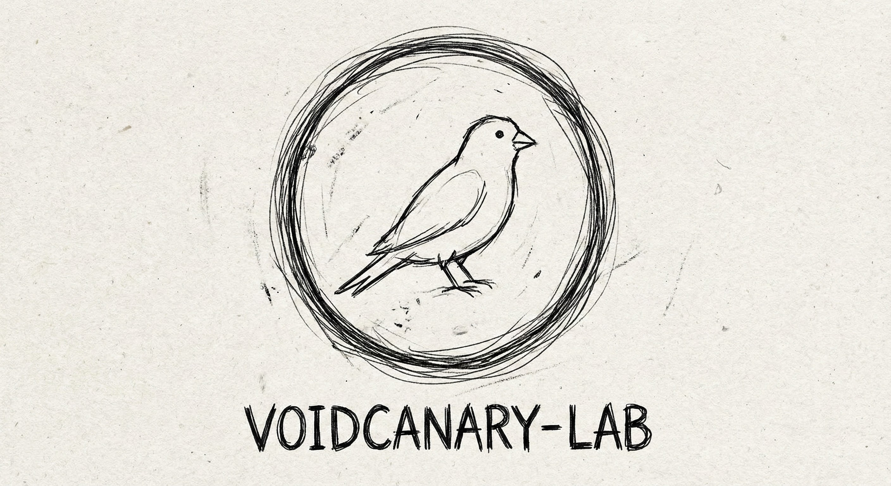

# Airlock




**Experimental research into formal verification of network state machines using Amaranth HDL.**

## Abstract
Airlock is a gateware research project exploring the application of Python-based Hardware Description Languages (HDL) to create a hardware-based security airlock. The `SecurityAirlock` module provides a set of formally verifiable security features to protect a network segment.

The primary goal is to demonstrate how Bounded Model Checking (BMC) can be used to mathematically prove that the airlock's security policies are correctly implemented.

## Features
- **Volume Limiting:** The airlock will lock down after a certain volume of traffic has passed.
- **TTL Enforcement:** Packets with a low TTL are dropped to prevent traceroute and other network mapping techniques.
- **WireGuard Heuristics:** The airlock can detect and block small, suspicious UDP packets that may indicate a covert channel.
- **Heartbeat Monitoring:** A hardware-level watchdog timer ensures the airlock is not bypassed by a compromised host.
- **Formal Verification:** The core security properties of the airlock are formally verified using SymbiYosys.

## Architecture

This project implements a "Virtual Bridge" for development, allowing the `SecurityAirlock` gateware to be simulated and verified against real network traffic.

```text
  +--------------------+      +-----------------------+      +-----------------------+
  |  Network Source    |----->|   Security Airlock    |<---->| Heartbeat Generator   |
  +--------------------+      | (Amaranth Gateware)   |      +-----------------------+
            |                 +-----------------------+                 |
            |                             |                             |
            v                             v                             v
  +--------------------+      +-----------------------+      +-----------------------+
  | Isolated Network   |<-----|   TAP Interface       |      |    Control Plane      |
  +--------------------+      +-----------------------+      +-----------------------+
```

### Repository Structure
 * `gateware/`: Core Amaranth HDL source code for the `SecurityAirlock`.
 * `infrastructure/`: Infrastructure-as-Code (Terraform/Ansible) for the test bench topology.
 * `verify/`: Formal proofs and assertions (SymbiYosys).

### Getting Started (Simulation)
This project requires Python 3.10+ and the Amaranth toolchain.
```bash
# 1. Install dependencies
pip install -r requirements.txt

# 2. Run the Virtual Bridge (Requires Root for TAP creation)
sudo python3 gateware/sim/bridge.py --rx tap0 --tx tap1
```

### Formal Verification
To run the formal proofs against the gateware logic:
```bash
cd gateware/verify
python3 proof.py
```

## License
Copyright (c) 2025 VoidCanary-Lab.
This project is licensed under the GNU General Public License v3.0.
